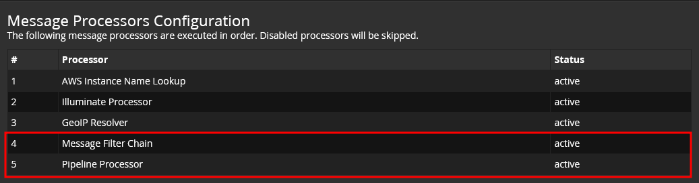
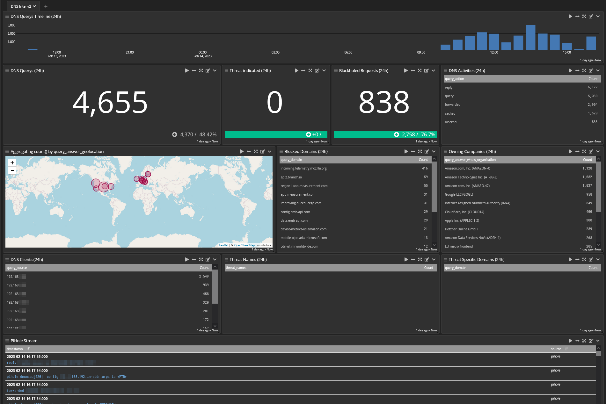

# Graylog4 supported
``Content Pack for PiHole 5 with Graylog``  
  
Built and based off of https://github.com/chateaulav/pihole & https://github.com/agreenbhm/pihole_graylog_content_pack which both rely heavily on https://jalogisch.de/2017/der-eigene-dns-resolver-zuhause/ Includes setting GeoIP, so ensure you download the current City db from Maxmind, and install the current Threat intelligence content packs. A seperate input is established to collect only pihole syslog traffic.

## Syslog requirements
**syslog-ng** *Best option, simple and only sends pihole data*
```
#apt install syslog-ng -y
#vi /etc/syslog-ng/conf.d/10-pihole.conf
source s_pihole_log { file("/var/log/pihole.log"); };
destination d_graylog {udp("server.ip" port(1515)); };
log { source(s_pihole_log); destination(d_graylog); };
```

### Graylog prerequisites:
Change the Message Processor Configuration within (System -> Configuration -> Message Processor Configuration):


### Dashboard Demo:


### Content Pack includes:

* **Input**:  
``Sets a seperate input for just pihole DNS Logs``
  * piHole Syslog (``Listen 0.0.0.0:1515/UDP``)
  
* **Extractor**:
  * app_name (sets to ``dnsmasq`` for matching messages)

* **Stream**:
  * PiHole Messages (adds messages with app_name = ``dnsmasq`` to separate stream and removes from All Messages) 

* **Pipeline**:  
``Creates Multiple fields to enable stronger queries and analytics``
  * -2 Rules:
    * ``drop pihole unnecessary messages``
  * -1 Rules:
    * ``dnsmasq pihole split``
  * 0 Rules:
    * ``PiHole GeoIP Set``
  * 1 Rules:
    * ``threatintel (dnsmasq)``
  * 2 Rules:
    * ``threatintel (2) inflate``
  
* **Lookup Table\Cache**:
  * geolite2-city (``/usr/share/graylog/data/GeoLite2-City.mmdb``)
  
* **Dashboard called ``DNS Intel``**:
  * DNS Activities Over Time (24h)
  * DNS Location Requested IP (from answers) (24h)
  * Threat Indicated Count (24h)
  * DNS Query Count (24)
  * DNS Query Logs (24h)
  * Threat Names (24h)
  * DNS Clients (24h)
  
